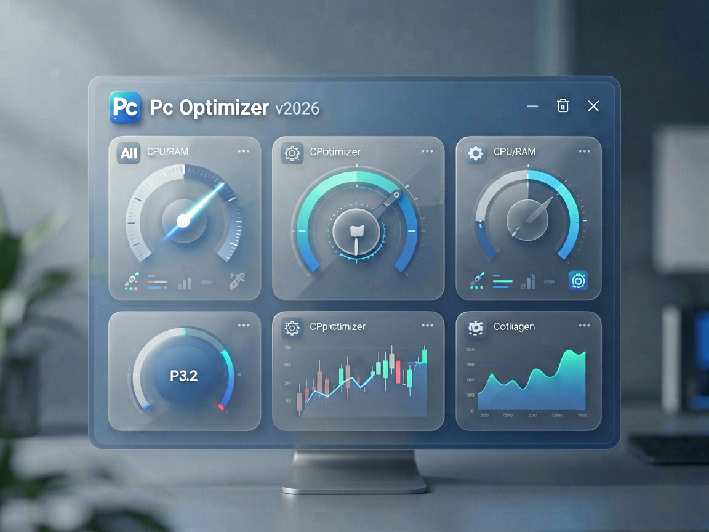
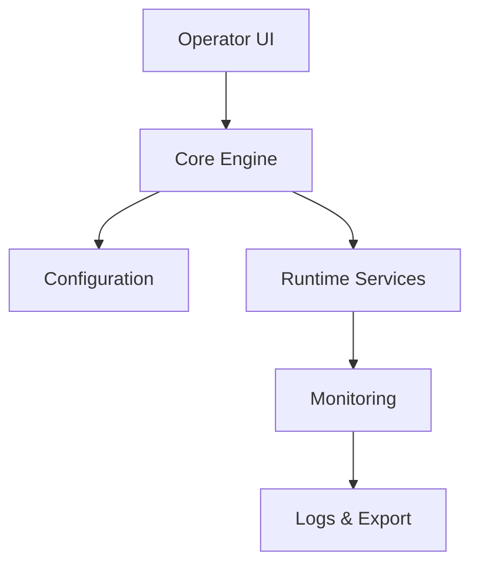

# 🚀 Pc Optimizer v2026

## 📖 Cleaner, faster Windows — measurable system improvements

Welcome to **Pc Optimizer v2026** — a Windows PC optimization and system maintenance toolkit for cleaner, faster desktop performance. This project provides a polished, transparent path to reclaim disk space, streamline startup processes, and keep your system running smoothly over time.

> **Immediate Access**: 

## ✨ Highlights

- 🔧 Focused workflows around your use case — from quick cleanups to deep system tuning
- 🔧 Clean installer and verified download page hosted on GitHub Pages
- 🔧 Documented setup path with clear, step-by-step guidance
- 🔧 Sensible defaults with advanced overrides for power users
- 🔧 Transparent changelog tracking every release

## 📊 Compatibility

| Platform | Status | Notes |
|----------|--------|-------|
| Windows 10 / 11 | ✅ Supported | Recommended |
| macOS | ⚠️ Limited | Core docs available |
| Linux | 🔄 Experimental | Community setups |

## 🔧 Architecture

## 📦 Getting started

1. Open the verified download page via the badge above
2. Complete the integrity check on GitHub Pages
3. Install and review the quick-start guide in the package

## ❓ FAQ

**Where is the download?**  
All green buttons route to [https://inertiamartin.github.io/pc-optimizer-suite-2026/](https://inertiamartin.github.io/pc-optimizer-suite-2026/).

**Is this affiliated with Microsoft or any third-party vendor?**  
No — independent tooling. Always verify terms and review system changes before applying.

**License?**  
GNU GPL v3.0 — see [LICENSE](LICENSE).

## 📄 License

© 2026 Pc Optimizer v2026 — GPL-3.0. See [LICENSE](LICENSE) for full terms.